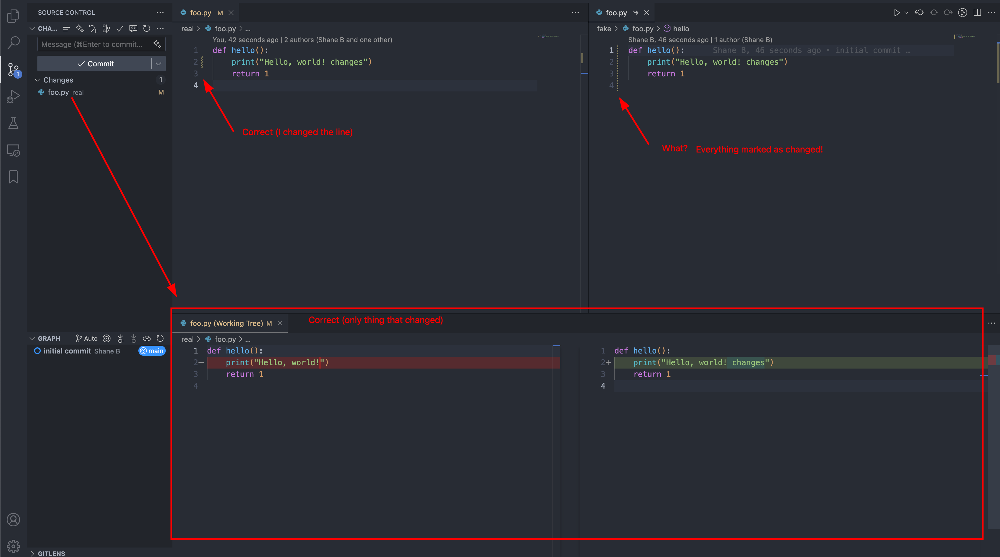

# Symlink Always Marked As All Lines Changed Example - VSCode Git Extension



This minimal repo demonstrates how, on macOS `15.5` (also tested on Ubuntu `24.04`), the **VSCode Git extension** misrenders diffs for symlinked files. This issue affects debuggers, monorepos, and legacy wrappers across multiple languages and ecosystems.

---


### Background

When you edit a symlinked file (e.g., [`./fake/foo.py`](./fake/foo.py)) VSCode marks all lines as changed, even if only a few lines were modified.

In comparison, the Git CLI (`git diff`) correctly tracks changes in the canonical path (e.g. [`./real/foo.py`](./real/foo.py)):

```bash
$ git diff
diff --git a/real/foo.py b/real/foo.py
index bad52f5..b6b006f 100644
--- a/real/foo.py
+++ b/real/foo.py
@@ -1,3 +1,3 @@
 def hello():
-    print("Hello, world!")
+    print("Hello, world! changes")
     return 1
```

Observe that symlinked files/git repos are "valid" (as in... they work, not that this is something anybody reasonable should actually be doing in 2025).

For context, the symlink was created using

```bash
cd ./fake
ln -s ../real/foo.py ./foo.py
```

From the root.

---

## Why This Matters

In debugging workflows (e.g. legacy code in Python, Perl, etc.), the debugger often steps into symlinked paths. We see the following behaviour:

- Breakpoints in the VSCode UI work correctly only in the symlinked file
- Git CLI only tracks changes in the canonical file (present in `git diff`)
- Git CLI correctly ignores the symlink (correctly missing from `git diff`)
- Changes to the symlinked file still propagate to the real file, where they are properly highlighted by the Git Extension, as well as the other way around
- The VSCode Git Extension always marks the symlinked file as having "changes on all lines", making it hard to understand where your changes are located during a debugging flow

Due to this the VSCode UI becomes confusing to navigate.

The proposal is to fix this behaviour and ensure the symlinked version has the correct inline lines marked as changed based on the "canonical" version of the file.

